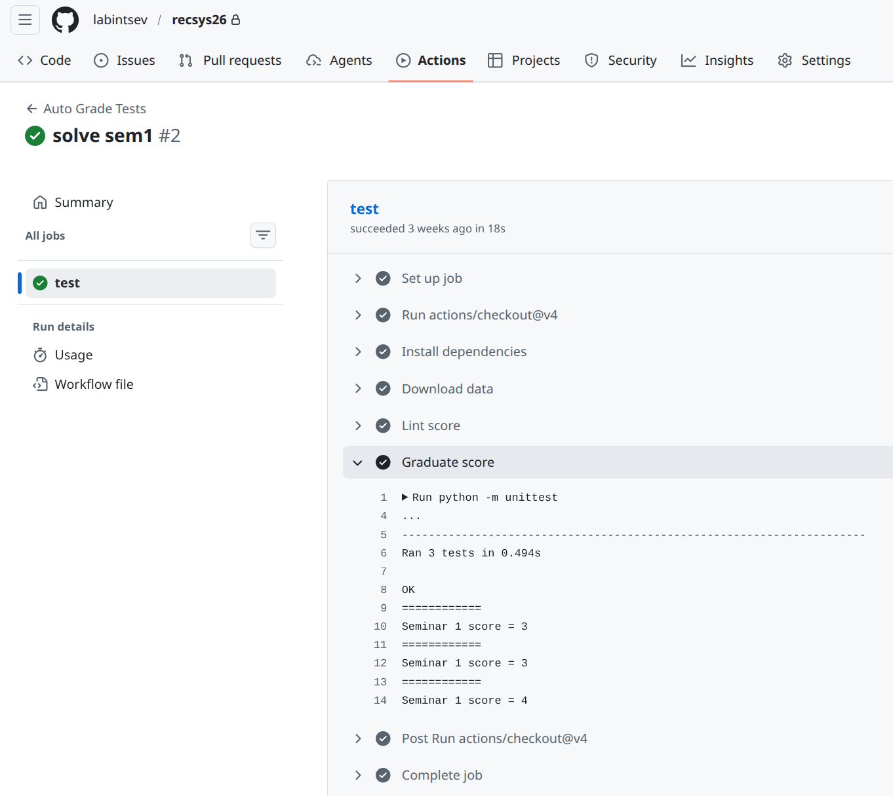

# Рекомендательные системы

Курс для студентов потока ДПИ22 весна 2026 год.

Практические задания включают в себя написание кода для рекомендательных систем в файлах `sem1.py`, `sem2.py` и т.д. .  
Для оценки используется файл `test.py`, в нем прописана логика оценки, которую менять нельзя!
Также используются [Github Actions](https://docs.github.com/en/actions) для проведения тестов и публикации результатов их исполнения. 

## Настройка окружения

1. Делаете форк этого репозитория через веб интерфейс github.  
Присылаете ссылку на свой форк на почту ailabintsev@fa.ru с указанием своей фамилии и группы.  

2. Клонируете свой форк на локальную машину  

```sh
git clone https://github.com/{your_name}/recsys_course.git
cs recsys_course 
```

3. Создаете виртуальное окружение и устанавливаете зависимости через интерфейс VsCode или CLI:

```sh
python3 -m venv .venv
source .venv/bin/activate
```

4. Скачайте данные и распакуйте в папку `data`

```sh
wget https://storage.yandexcloud.net/labintsev/ml-latest-small.zip  
unzip ml-latest-small.zip -d data
rm ml-latest-small.zip
```

Подробное описание данных - [здесь](doc/ReadmeRu.md) 


## Общий алгоритм вашей работы

На примере первого задания:

- реализуете недостающий код в функциях в файле `sem1.py`

- проверяете работу, дебаг по необходимости:

```sh
python sem1.py
```

- локально тестируете прохождение тестов и начисление баллов

```sh
python test.py
```

- если тесты проходят, делаете коммит файла и пушите в свой репо.

- на вкладке Actions проверяете корректное прохождение тестов и начисление баллов.



## Тема 1. Простейшие рекомендации

Функция `random_recommend` - рекомендует случайные фильмы - 3 балла (уже решено для примера).  
Функция `top_n_recommend` - самые популярные фильмы на основе среднего рейтинга и количества оценок - 3 балла.  
Функция `evaluate_rec_systems` - вычисляет метрику Accuracy для двух подходов: случайные и популярные фильмы - 4 балла.  
